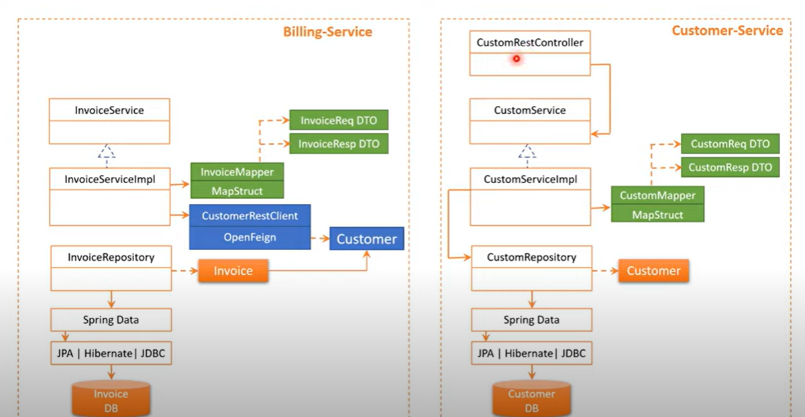
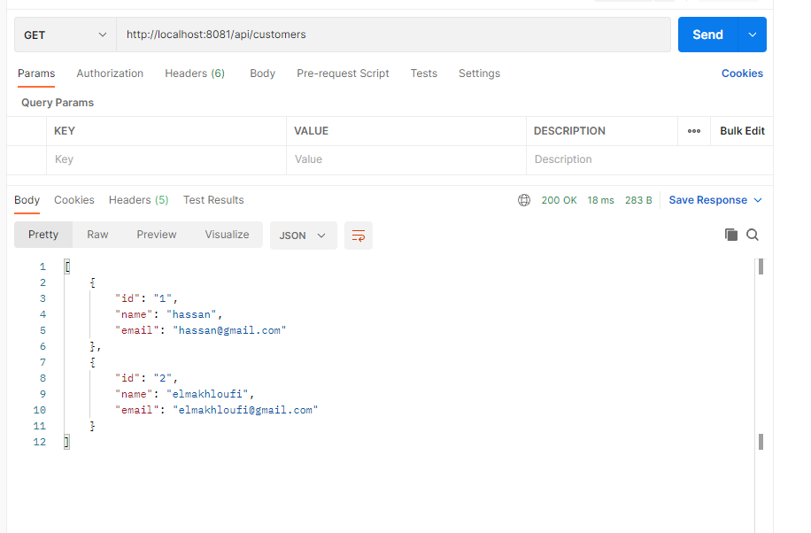
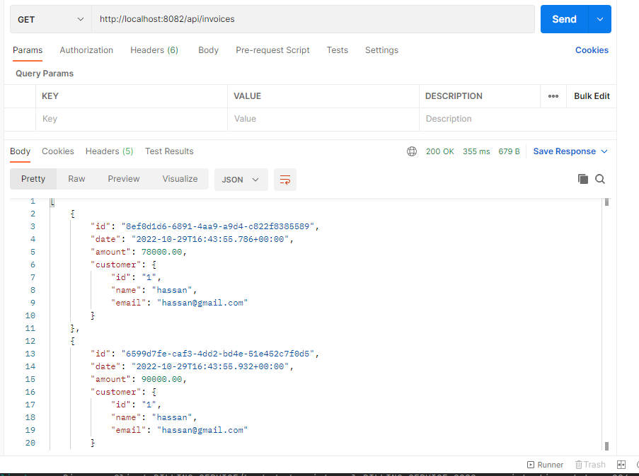

## Architecture de l'application 



## Customer entity

````java
package ma.hassan.customerservice.entities;

import lombok.AllArgsConstructor;
import lombok.Data;
import lombok.NoArgsConstructor;

import javax.persistence.Entity;
import javax.persistence.GeneratedValue;
import javax.persistence.GenerationType;
import javax.persistence.Id;


@Entity
public class Customer {

    @Id
    @GeneratedValue(strategy = GenerationType.IDENTITY)
    private String id;
    private String name ;
    private String email;

    public Customer() {
    }

    public Customer(String id, String name, String email) {
        this.id = id;
        this.name = name;
        this.email = email;
    }

}

````
## customer repository
```java
package ma.hassan.customerservice.repositories;

import ma.hassan.customerservice.entities.Customer;
import org.springframework.data.jpa.repository.JpaRepository;

public interface CustomerRepository extends JpaRepository<Customer,String> {
}

```
## Customer DTO
- Customer request DTO 
````java
package ma.hassan.customerservice.DTOs;

import lombok.AllArgsConstructor;
import lombok.Data;
import lombok.NoArgsConstructor;


public class CustomerRequestDTO {
    private String id;
    private String name ;
    private String email;

    public CustomerRequestDTO(String id, String name, String email) {
        this.id = id;
        this.name = name;
        this.email = email;
    }

    public CustomerRequestDTO() {
    }

}

````

## Customer DTO
- Customer response DTO
````java
package ma.hassan.customerservice.DTOs;

import lombok.AllArgsConstructor;
import lombok.Data;
import lombok.NoArgsConstructor;


public class CustomerResponseDTO {
    private String id;
    private String name ;
    private String email;

    public CustomerResponseDTO() {
    }

    public CustomerResponseDTO(String id, String name, String email) {
        this.id = id;
        this.name = name;
        this.email = email;
    }

}

````

## Customer Service 
````java
package ma.hassan.customerservice.services;

import ma.hassan.customerservice.DTOs.CustomerRequestDTO;
import ma.hassan.customerservice.DTOs.CustomerResponseDTO;
import org.springframework.stereotype.Service;

import java.util.List;

@Service
public interface CustomerService {

    CustomerResponseDTO save(CustomerRequestDTO customerRequestDTO);
    CustomerResponseDTO getCustomer(String id );
    CustomerResponseDTO update(CustomerRequestDTO customerRequestDTO);
    List<CustomerResponseDTO> listCustomers();


}

````

## Customer Controller 
````java
package ma.hassan.customerservice.web;

import ma.hassan.customerservice.DTOs.CustomerRequestDTO;
import ma.hassan.customerservice.DTOs.CustomerResponseDTO;
import org.springframework.web.bind.annotation.*;
import ma.hassan.customerservice.services.CustomerService;

import java.util.List;

@RestController
@RequestMapping(path = "/api")

public class Controller {
    private CustomerService customerService ;

    public Controller(CustomerService customerService) {
        this.customerService = customerService;
    }

    @GetMapping(path = "/customers")
    public List<CustomerResponseDTO> allCustomers(){
        return customerService.listCustomers();
    }

    @PostMapping(path = "/customers")
    public CustomerResponseDTO save(CustomerRequestDTO customerRequestDTO){
        return  customerService.save(customerRequestDTO);
    }

    @GetMapping(path = "/customers/{id}")
    public CustomerResponseDTO getCustomer(@PathVariable String  id){
        return  customerService.getCustomer(id);
    }
}

````
## Test 
````java
package ma.hassan.customerservice;

import ma.hassan.customerservice.DTOs.CustomerRequestDTO;
import org.springframework.boot.CommandLineRunner;
import org.springframework.boot.SpringApplication;
import org.springframework.boot.autoconfigure.SpringBootApplication;
import org.springframework.context.annotation.Bean;
import ma.hassan.customerservice.services.CustomerService;

@SpringBootApplication
public class CustomerServiceApplication {

    public static void main(String[] args) {
        SpringApplication.run(CustomerServiceApplication.class, args);
    }
    @Bean
    CommandLineRunner start(CustomerService customerService){
        return args -> {
            customerService.save(new CustomerRequestDTO("C01","hassan","hassan@gmail.com"));
            customerService.save(new CustomerRequestDTO("C02","elmakhloufi","elmakhloufi@gmail.com"));

        };
    }
}
````
## Test of customer service



## Dockerfile 

````dockerfile
FROM adoptopenjdk/openjdk8

EXPOSE 8081
COPY target/*.jar customer-service.jar

ENTRYPOINT exec java $JAVA_OPTS -jar customer-service.jar
````

## Billing service 

## Invoice Entity
````java
package ma.hassan.billing.entities;

import lombok.AllArgsConstructor;
import lombok.Data;
import lombok.NoArgsConstructor;

import javax.persistence.Entity;
import javax.persistence.Id;
import javax.persistence.Transient;
import java.math.BigDecimal;
import java.util.Date;

@Entity
@Data @AllArgsConstructor @NoArgsConstructor
public class Invoice {
    @Id
    private String id;
    private Date date;
    private BigDecimal amount;
    private String customerId;
    @Transient
    private Customer customer;
    
}

````

## class customer
````java
package ma.hassan.billing.entities;

import lombok.Data;

@Data
public class Customer {

    private String id;
    private String name;
    private String email;


    public Customer(String id, String name, String email) {
        this.id = id;
        this.name = name;
        this.email = email;
    }

    public Customer() {

    }
}
````
## Invoice Request DTO
````java
package ma.hassan.billing.DTOs;


import lombok.Data;
import lombok.NoArgsConstructor;

import java.math.BigDecimal;

@Data  @NoArgsConstructor
public class InvoiceRequestDTO {
    private BigDecimal amount;
    private String customerId;

    public BigDecimal getAmount() {
        return amount;
    }

    public InvoiceRequestDTO(BigDecimal amount, String customerId) {
        this.amount = amount;
        this.customerId = customerId;
    }

}

````

## Invoice Response DTO 
````java

package ma.hassan.billing.DTOs;

import lombok.AllArgsConstructor;
import lombok.Data;
import lombok.NoArgsConstructor;
import ma.hassan.billing.entities.Customer;


import java.math.BigDecimal;
import java.util.Date;


public class InvoiceResponseDTO {

    private String id;
    private Date date;
    private BigDecimal amount;
    private Customer customer;

    public InvoiceResponseDTO(String id, Date date, BigDecimal amount, Customer customer) {
        this.id = id;
        this.date = date;
        this.amount = amount;
        this.customer = customer;
    }

    public InvoiceResponseDTO() {

    }


}

````

## Invoice Respository 
````java
package ma.hassan.billing.repositories;

import ma.hassan.billing.entities.Invoice;
import org.springframework.data.jpa.repository.JpaRepository;

import java.util.List;

public interface InvoiceRepository extends JpaRepository<Invoice,String> {

    List<Invoice> findByCustomerId(String clientId);
}

````
## Customer Rest Client

````java
package ma.hassan.billing.openfeign;

import ma.hassan.billing.entities.Customer;
import org.springframework.cloud.openfeign.FeignClient;
import org.springframework.web.bind.annotation.GetMapping;
import org.springframework.web.bind.annotation.PathVariable;

import java.util.List;

@FeignClient(name = "CUSTOMER-SERVICE")

public interface CustomerRestClient {
    @GetMapping(path="/api/customers/{id}")
    Customer getCustomer(@PathVariable (name = "id")String id);

    @GetMapping(path = "/api/customers")
    List<Customer> allCustomers();

}

````
## Invoice Service 
````java
package ma.hassan.billing.services;


import ma.hassan.billing.DTOs.InvoiceRequestDTO;
import ma.hassan.billing.DTOs.InvoiceResponseDTO;
import org.springframework.stereotype.Service;

import java.util.List;

@Service
public interface InvoiceService {

    public InvoiceResponseDTO save(InvoiceRequestDTO invoiceRequestDTO);

    public InvoiceResponseDTO getInvoice(String InvoiceId);

    List<InvoiceResponseDTO> invoicesByCustomerId(String customerId);

    List<InvoiceResponseDTO> allInvoices();
}

````

## Invoice Rest Contoller 
````java
package ma.hassan.billing.web;

import lombok.AllArgsConstructor;
import ma.hassan.billing.DTOs.InvoiceRequestDTO;
import ma.hassan.billing.DTOs.InvoiceResponseDTO;
import ma.hassan.billing.services.InvoiceService;
import org.springframework.web.bind.annotation.*;

import java.util.List;

import static org.aspectj.weaver.tools.cache.SimpleCacheFactory.path;

@RestController
@RequestMapping(path = "/api")
public class invoiceRestController {
    private InvoiceService invoiceService ;
    public invoiceRestController (InvoiceService invoiceService) {
        this.invoiceService = invoiceService;
    }

    @GetMapping(path = "/invoices/{id}")
    public InvoiceResponseDTO getInvoice(@PathVariable(name = "id") String invoiceId){
        return invoiceService.getInvoice(invoiceId);

    }
    @GetMapping(path = "/invoicesByCustomer/{customerId}")
    public List<InvoiceResponseDTO> getInvoicesByCustomer (@PathVariable(name = "customerId") String customerId){
        return invoiceService.invoicesByCustomerId(customerId);

    }

    @PostMapping(path = "/invoices")
    public InvoiceResponseDTO save(InvoiceRequestDTO invoiceRequestDTO) {
        return invoiceService.save(invoiceRequestDTO);


    }

    @GetMapping(path = "/invoices")
    public List<InvoiceResponseDTO> getAllInvoices(){
        return invoiceService.allInvoices();
    }


}

````

## Test 


## Docker file 
````Dockerfile
FROM adoptopenjdk/openjdk8

EXPOSE 8082
COPY target/*.jar billing-service.jar
ENTRYPOINT exec java $JAVA_OPTS -jar billing-service.jar
````
